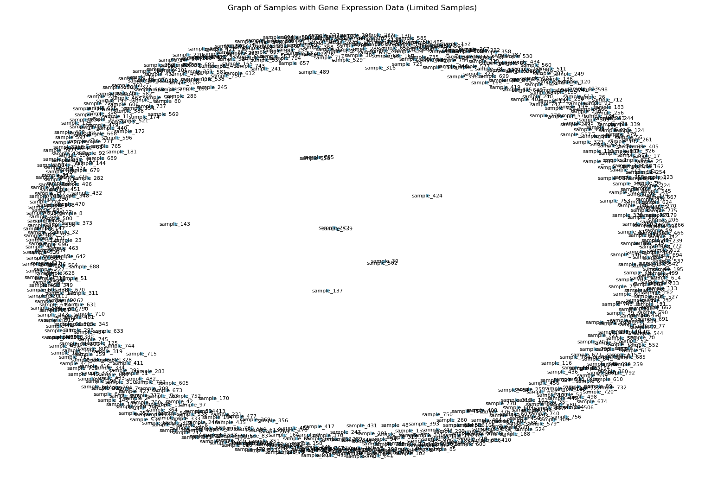
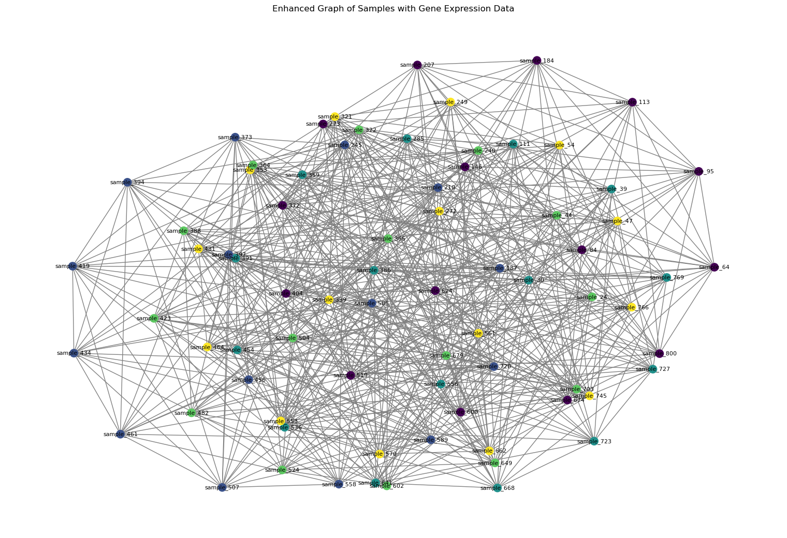

# Graph Neural Network for Cancer Subtype Classification

## Overview
This project implements a **Graph Neural Network (GNN)** to classify cancer subtypes using gene expression data.  
Unlike traditional machine learning approaches that treat each sample independently, this work models patient samples as **nodes in a graph**, enabling the model to learn both **feature-level** and **relationship-based** patterns.

This repository focuses specifically on the **GNN-based classification module**, implemented as an independent component of a larger academic research project on cancer gene expression analysis.

---

## Dataset Description
The dataset consists of gene expression profiles collected from patients diagnosed with five different cancer subtypes:

- Breast Cancer (BRCA)
- Kidney Renal Cancer (KIRC)
- Colon Cancer (COAD)
- Lung Adenocarcinoma (LUAD)
- Prostate Cancer (PRAD)

Each sample contains expression values for over **20,000 genes**, resulting in a highly high-dimensional dataset.  
Due to size and licensing constraints, the dataset is **not included** in this repository.  
The dataset source, composition, and clinical background are documented in the associated academic report.

---

## Data Preprocessing
Gene expression data is inherently noisy and high-dimensional.  
To prepare the data for graph-based deep learning, the following preprocessing steps were performed:

- Removal of non-informative identifiers
- Separation of feature matrix and class labels
- Normalization of gene expression values to ensure uniform scaling
- Conversion of processed features into tensor format compatible with deep learning frameworks

These steps ensure numerical stability and improve convergence during training.

---

## Dimensionality Reduction
With over 20,000 gene features per sample, dimensionality reduction is essential.

**Principal Component Analysis (PCA)** was applied to:
- Reduce feature redundancy
- Retain components with maximum variance
- Improve computational efficiency without significant information loss

After PCA, the reduced feature representation preserves the most informative genetic patterns required for classification.

---

## Graph Construction
Instead of treating samples independently, the dataset is modeled as a **graph structure**:

- Each **node** represents a patient sample
- Node features correspond to PCA-reduced gene expression vectors
- **Edges** represent similarity relationships between samples based on their feature representations

This formulation allows the model to exploit relational information between samples, which is particularly valuable in biological datasets where latent dependencies exist.

### Sample-level Graph Visualization (Limited Samples)
The initial visualization below shows a graph constructed from a subset of samples for clarity, as the full graph is extremely dense.

### Enhanced Sample-level Graph Visualization
An enhanced visualization of the same graph highlights the dense inter-sample connectivity patterns that are leveraged during GNN training.

---

## Class-wise Graph Analysis
To analyze **intra-class relationships**, separate subgraphs were constructed for each cancer subtype.  
Multiple layout algorithms were used to better understand structural properties:

- Kamada–Kawai layout
- Spring layout
- Circular layout

The figure below shows class-wise graph structures for all five cancer subtypes.

These visualizations reveal consistent connectivity patterns within each class while also highlighting structural differences across cancer subtypes.

---

## Graph Neural Network (GNN) Model
A **Graph Neural Network** was implemented for node-level classification.

Key characteristics:
- Node embeddings are updated through neighborhood aggregation
- Each node learns from both its own features and its connected neighbors
- The model captures complex relational patterns not accessible to traditional ML models

This architecture is particularly suited for biological datasets where relationships between samples play a significant role.

---

## Training Strategy
The model was trained using:

- Cross-entropy loss for multi-class classification
- Adam optimizer for efficient convergence
- Train and validation masks to prevent information leakage between samples

Only labeled training nodes contribute to the loss during optimization.

---

## Evaluation Metrics
Model performance was evaluated using standard classification metrics:

- Accuracy
- Precision
- Recall
- F1-score

These metrics provide a balanced evaluation of model performance across cancer subtypes.

---

## Key Insights
- Graph-based learning effectively captures inter-sample relationships in gene expression data
- GNNs provide a natural framework for modeling biological similarity networks
- Dimensionality reduction combined with graph learning enables scalable deep learning on high-dimensional genomic data

---

## Limitations and Future Work
- Edge construction can be improved using biological priors or pathway-level knowledge
- Integration of multi-omics data may enhance classification performance
- Graph Attention Networks (GAT) could improve interpretability by highlighting influential neighbors

---

## Repository Scope
This repository specifically documents the **Graph Neural Network implementation, graph construction, and graph-based analysis** performed as part of a broader academic research project.

---

## Author Contribution
The GNN-based modeling, graph construction, visualization, training, and evaluation components were independently implemented and documented in this repository.
